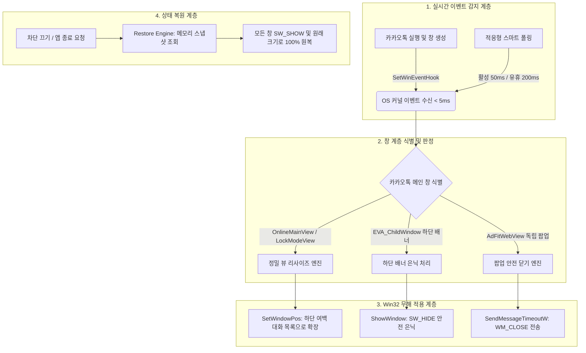

# 💬 KakaoTalk Layout AdBlocker v11 (Rust Native)

> **관리자 권한(UAC)·시스템 변조·hosts 수정 없이, 순수 Win32 레이아웃 제어로 동작하는 초경량 카카오톡 광고 차단기**

[-0078D6?logo=windows)](https://github.com/twbeatles/kakaotalk-layout-adblocker/releases)
[](https://www.rust-lang.org/)
[](LICENSE)
[](#-안전한-순수-레이아웃-차단-layout-only)
[]()
[-brightgreen)]()

**Windows PC용 카카오톡 레이아웃 기반 무해한 광고 차단기**입니다.

기존의 번거롭고 시스템에 위험을 주는 광고 차단 방식(`hosts` 파일 수정, DNS 캐시 변조, AdFit 레지스트리 조작, 패킷 감청, 타 프로세스 메모리 패치)을 **전혀 사용하지 않습니다.** 순수 **Windows 표준 Win32 API를 통한 윈도우 레이아웃 재계산 및 광고 창 은닉**만으로 동작하여 카카오톡의 모든 정상 기능(채팅, 파일 전송, 선물하기, 페이 등)과 시스템 환경을 완벽하게 보호합니다.

순수 Rust 네이티브(`kakao-adblock-rs`)로 컴파일되어 **메모리 약 4~7MB, 유휴 CPU 0.01%대**의 압도적인 초경량·초저지연 성능을 제공하며, **관리자 권한(UAC)이 필요 없어 회사 업무용 PC에서도 안심하고 사용**할 수 있습니다.

---

## 📑 목차

1. [🚀 빠른 시작 (3단계 사용법)](#-빠른-시작-3단계-사용법)
2. [✨ 핵심 가치 및 특징 (Value Proposition)](#-핵심-가치-및-특징-value-proposition)
3. [📊 솔루션 비교 매트릭스 (Fact-based Comparison)](#-솔루션-비교-매트릭스-fact-based-comparison)
4. [⚙️ 상세 기능 및 동작 원리 (Deep Feature Breakdown)](#️-상세-기능-및-동작-원리-deep-feature-breakdown)
5. [🖥️ 시스템 트레이 사용 가이드](#️-시스템-트레이-사용-가이드)
6. [⌨️ CLI 명령줄 옵션 및 진단 도구](#️-cli-명령줄-옵션-및-진단-도구)
7. [⚙️ 설정 및 규칙 커스터마이징](#️-설정-및-규칙-커스터마이징)
8. [❓ 자주 묻는 질문 및 문제 해결 (FAQ)](#-자주-묻는-질문-및-문제-해결-faq)
9. [🛠️ 개발 및 빌드 가이드 (For Developers)](#️-개발-및-빌드-가이드-for-developers)
10. [📜 라이선스 및 크레딧](#-라이선스-및-크레딧)

---

## 🚀 빠른 시작 (3단계 사용법)

복잡한 설치 과정 없이 다운로드 후 바로 사용할 수 있습니다.

### 1단계: 압축 파일 다운로드
[GitHub Releases](https://github.com/twbeatles/kakaotalk-layout-adblocker/releases)에서 최신 버전의 **`KakaoTalkLayoutAdBlocker_v11.zip`**을 다운로드하고 원하는 폴더에 압축을 풉니다.  
압축을 풀면 같은 폴더에 다음 두 파일이 포함되어 있습니다:
- **`KakaoTalkLayoutAdBlocker_v11.exe`** — 메인 광고 차단 앱
- **`kakao-updater.exe`** — Ed25519 서명 검증 기반 원클릭 자동 업데이트 헬퍼

> 💡 **권장 설치 위치**: `C:\Tools\KakaoTalkAdBlocker\` 등 로컬 드라이브의 안정적인 일반 폴더에 배치하는 것을 권장합니다. (바탕화면의 클라우드/OneDrive 동기화 폴더 제외 권장)

### 2단계: 더블클릭 실행
`KakaoTalkLayoutAdBlocker_v11.exe`를 더블클릭하여 실행합니다.
- **관리자 권한을 묻는 UAC 팝업창이 전혀 뜨지 않습니다.**
- 실행 즉시 작업표시줄 알림 영역(시계 옆 시스템 트레이)에 **노란색 방패 아이콘**이 나타나며, 카카오톡의 하단 배너 광고와 팝업 광고가 즉시 사라집니다.

### 3단계: 부팅 시 자동 실행 등록 (선택 사항)
트레이 아이콘을 **우클릭**한 후 **`시작프로그램 등록`**을 클릭하면 PC 부팅 시마다 백그라운드에서 자동으로 조용히 실행됩니다.

---

## ✨ 핵심 가치 및 특징 (Value Proposition)

```text
┌────────────────────────────────────────────────────────────────────────┐
│                   KakaoTalk Layout AdBlocker (v11)                     │
├───────────────────┬────────────────────────────┬───────────────────────┤
│  1. Layout-Only   │       2. Rust Native       │     3. Zero-Admin     │
│  순수 레이아웃 제어 │       초경량·초저전력      │     관리자 권한 불필요 │
│  hosts/DNS 변조 0% │  RAM 4~7MB / CPU 0.01%대   │  사내 업무용 PC 완벽대응 │
└───────────────────┴────────────────────────────┴───────────────────────┘
```

- 🛡️ **안전한 순수 레이아웃 제어 (Layout-Only)**
  - `hosts` 파일 변조, DNS 캐시 조작, 프록시 설정, 패킷 가로채기를 **일체 하지 않습니다.**
  - 카카오톡 내부 메모리 코드를 후킹하거나 바이너리를 패치하지 않으므로 백신 오탐이나 카톡 계정 제재의 위험이 원천 차단됩니다.
- ⚡ **Rust 네이티브 초경량 & 초저지연 성능 (유휴 CPU 0.01%대)**
  - Python 등 무거운 인터프리터 런타임 없이 C/Rust 수준의 순수 Win32 네이티브 바이너리로 구동됩니다.
  - 상시 상주 메모리(Working Set) **4MB ~ 7MB**, 유휴 상태 CPU 점유율 **0.01% 미만**으로 노트북 배터리와 시스템 자원을 거의 소모하지 않습니다.
  - `SetWinEventHook` 커널 이벤트 감지를 통해 창 생성 시 **5ms 이내**로 즉각 반응하여 광고 깜빡임 없이 처리합니다.
- 🏢 **무권한(Non-UAC) 구동 — 회사 업무용 PC 완벽 지원**
  - 관리자 계정 권한(UAC) 없이 100% 일반 사용자 권한으로 동작합니다.
  - 보안 통제가 엄격한 회사 컴퓨터나 공용 PC에서도 사내 보안 규정을 위반하지 않고 안전하게 사용할 수 있습니다.
- 🔄 **완벽하고 안전한 원상 복구 (Clean Restoration)**
  - 트레이 메뉴에서 `차단 끄기`를 누르거나 프로그램을 `종료`하면, 숨겨졌거나 조정된 모든 창이 0.1초 만에 원래 순정 상태로 깨끗하게 복구됩니다.
- 🎯 **최신 카카오톡 UI 및 독립 팝업 완벽 대응**
  - 친구 목록 하단 배너뿐 아니라 친구 탭, 채팅 탭, 피드 뷰, 잠금 모드 뷰, 그리고 독립적으로 팝업되는 `AdFitWebView` 광고 창까지 정밀하게 차단합니다.
- 🔒 **Ed25519 전자 서명 기반 원클릭 자동 업데이트**
  - GitHub 릴리스의 Ed25519 공개키 서명과 SHA-256 해시를 검증하여 변조 위험 없이 안전하게 최신 버전으로 자동 업그레이드 및 롤백을 지원합니다.

---

## 📊 솔루션 비교 매트릭스 (Fact-based Comparison)

| 비교 항목 | hosts / DNS 차단 방식 | 메모리 패치 / DLL 인젝션 | 타사 스크립트 기반 차단기 | **KakaoTalk Layout AdBlocker (본 프로젝트)** |
| :--- | :---: | :---: | :---: | :---: |
| **차단 메커니즘** | 네트워크 도메인 차단 | 타 프로세스 메모리 조작 | 단순 마우스 매크로/폴링 | **순수 Win32 레이아웃 재계산 및 은닉** |
| **관리자 권한 (UAC)** | **필수** (시스템 파일 수정) | **필수** (메모리 쓰기 권한) | 보통 필요 | **불필요 (일반 사용자 권한 100%)** |
| **시스템/네트워크 영향** | DNS 왜곡, 인터넷 장애 위험 | 보안 솔루션 충돌 위험 | CPU 점유율 유발 | **영향 0% (네트워크 0바이트 조작)** |
| **카카오톡 기능 영향** | 선물하기/페이/이모티콘 오류 발생 | 카톡 업데이트 시 크래시 | 비정상 클릭 발생 가능 | **모든 정상 기능 100% 완벽 작동** |
| **하단 빈 여백 처리** | 흰색/회색 빈 공간 그대로 방치 | 처리 불가 | 여백 남음 | **메인 뷰가 하단 끝까지 깔끔하게 채워짐** |
| **팝업 광고(AdFit) 처리** | 도메인 단위 불완전 차단 | 강제 프로세스 킬 | 대응 어려움 | **`SendMessageTimeoutW` 안전 닫기** |
| **상주 메모리 (RAM)** | 20MB ~ 50MB | 10MB ~ 30MB | 30MB ~ 80MB (Python/Node) | **3MB ~ 7MB (초경량 Rust 네이티브)** |
| **유휴 CPU 점유율** | 상시 수 % | 낮음 | 0.5% ~ 2.0% | **0.01% 미만 (사실상 0%)** |
| **원클릭 원상 복구** | hosts 수동 복원 필요 | 재부팅 필요 | 창 좌표 깨짐 | **트레이 원클릭 즉시 100% 원복** |
| **회사/사내 PC 사용** | 불가 (보안 규정 위반) | 불가 (악성코드 오탐) | 불안정 | **완벽 대응 (보안 솔루션 무간섭)** |

---

## ⚙️ 상세 기능 및 동작 원리 (Deep Feature Breakdown)

본 프로그램은 카카오톡 내부 코드를 변조하거나 네트워크를 감청하지 않고, 순수 Windows API를 사용하여 윈도우 레이아웃을 최적화합니다.



### 1. 🛡️ 안전한 순수 레이아웃 제어 (Layout-Only)
- `hosts` 파일을 조작하여 광고 도메인을 차단하는 기존 방식은 카카오톡 서버의 IP 변경 시 카카오톡 로그인이 차단되거나 이미지/파일 전송 실패, 이모티콘 샵 먹통 등의 부작용을 낳습니다.
- 본 도구는 네트워크 계층을 일절 건드리지 않고, 카카오톡 윈도우가 화면에 표시될 때 Win32 API 레벨에서 광고 창 영역을 숨기고 친구/채팅 목록의 크기를 아래로 늘려 채우는 방식을 사용합니다.

### 2. ⚡ Rust 네이티브 초저지연 아키텍처 (SetWinEventHook & 적응형 폴링)
- **`SetWinEventHook` 커널 훅**: 윈도우 생성(`EVENT_OBJECT_CREATE`), 표시(`EVENT_OBJECT_SHOW`), 활성화(`EVENT_SYSTEM_FOREGROUND`)를 OS 레벨에서 즉시 수신하여 **5ms 이내의 극도로 짧은 지연시간**으로 광고를 제거합니다. 창을 열었을 때 광고가 깜빡거리며 사라지는 현상이 없습니다.
- **적응형 폴링 (Adaptive Polling)**: 카카오톡이 활성 사용 중일 때는 `50ms`, 유휴 상태일 때는 `200ms`로 동작 주기를 조절하여 불필요한 연산을 방지합니다.
- **초고속 최적화**: 0.001ms 미만의 프로세스 liveness 검사, UTF-16 제로-알로케이션 프로세스명 비교(`eq_wide_ascii_case`), 메인 윈도우 O(1) 캐싱을 적용해 CPU 점유율을 0.01% 수준으로 유지합니다.

### 3. 📐 정밀 뷰 리사이즈 공식 (Layout Expansion Formula)
광고 창을 숨긴 후 하단에 남는 빈 공백을 메인 목록 뷰가 깔끔하게 채우도록 정밀하게 계산하여 크기를 확장합니다:
- **`OnlineMainView*` (친구 목록 / 채팅 목록 기본 뷰)**:
  $$\text{너비} = \text{부모 창 너비} - 2\text{px}, \quad \text{높이} = \text{부모 창 높이} - 31\text{px}$$
- **`LockModeView*` (잠금 화면 뷰)**:
  $$\text{너비} = \text{부모 창 너비} - 2\text{px}, \quad \text{높이} = \text{부모 창 높이}$$
- 창 크기 변경 시 `SWP_NOMOVE | SWP_NOZORDER | SWP_NOACTIVATE` 플래그를 조합하여 포커스 뺏김이나 z-order 뒤틀림, 화면 깜빡임을 방지합니다.

### 4. 🚫 하단 배너 은닉 및 종속 팝업(`AdFitWebView`) 안전 닫기
- 친구 목록 하단에 렌더링되는 `EVA_ChildWindow` 배너를 `SW_HIDE`로 은닉합니다.
- 카카오톡 부모 창에 종속되어 별도로 팝업되는 `AdFitWebView` 광고 창은 `SendMessageTimeoutW` API를 사용하여 500ms 타임아웃을 두고 안전하게 `WM_CLOSE` 메시지를 전송해 프로세스 행(Hang) 없이 닫습니다. 만약 팝업이 닫기를 거부할 경우 즉시 Zero-size/은닉 폴백 경로로 사용자 화면에서 보이지 않도록 격리합니다.

### 5. 🔄 100% 무손실 상태 원상 복구 (Clean Restoration Engine)
- 창을 조작하기 전, 해당 윈도우의 원래 HWND, 좌표, 크기, 가시성 상태를 프로세스 내부 메모리 스냅샷에 안전하게 기록합니다.
- 트레이 메뉴에서 **`차단 끄기`**를 누르거나 프로그램을 **`종료`**하면, 스냅샷에 저장된 모든 창을 원래 위치와 크기로 복원하고 `SW_SHOW`를 호출하여 0.1초 만에 순정 카카오톡 상태로 되돌립니다.
- 윈도우 종료 레이스 컨디션으로 인해 복원에 실패하더라도 지수 백오프 기반의 재시도 큐에 보관되어 안정적으로 재시도합니다.

### 6. 🔒 무권한(Non-UAC) 구동 & 스마트 시작프로그램
- 관리자 권한이 필요한 시스템 레지스트리(`HKLM`)나 시스템 폴더를 건드리지 않고, 현재 사용자 레지스트리인 `HKCU\Software\Microsoft\Windows\CurrentVersion\Run`에만 등록합니다.
- Windows 부팅 직후 작업표시줄 탐색기(`Shell_TrayWnd`)가 늦게 로딩되는 환경을 고려하여 셸이 준비될 때까지 기다린 후 트레이 아이콘을 등록(`TaskbarCreated` 메시지 감지)하므로 아이콘이 증발하지 않습니다.

### 7. 🔐 Ed25519 전자 서명 기반 안전 자동 업데이트
- 최신 릴리스 확인 시 공개키 기반 **Ed25519 전자 서명**과 **SHA-256 해시**를 이중으로 검증하여 변조된 바이너리의 실행을 원천 차단합니다.
- 전용 업데이트 헬퍼(`kakao-updater.exe`)가 기존 프로세스를 정상 종료하고, 새 바이너리로 교체한 뒤 자동 재시작을 수행하며, 교체 실패 시 이전 버전으로 즉시 자동 롤백합니다.

---

## 🖥️ 시스템 트레이 사용 가이드

작업표시줄 알림 영역(시계 옆)의 노란색 방패 아이콘을 **우클릭**하면 직관적인 팝업 메뉴가 나타납니다.

```text
  KakaoTalk Layout AdBlocker             ← 프로그램 이름
  차단 ON · 공격 모드 ON · 메인윈도우 1   ← [상태] 현재 작동 및 탐지 상태
  누적 숨김 3 · 누적 닫힘 0 · 누적 리사이즈 12
  복원 실패 2건 (초기화 가능)             ← [상태] 복원 실패가 있을 때만 노출
  --------------------------
  차단 끄기 / 차단 켜기         ← [원클릭 토글] 광고 차단 활성화/일시 정지 (원복)
✓ 공격 모드                    ← [고급] 광고 키워드 토큰 기반 심화 차단
✓ 시작프로그램 등록             ← Windows 부팅 시 자동 시작 등록/해제
  복원 실패 초기화              ← 원복 실패 카운터 리셋 (실패 발생 시 활성화)
  --------------------------
  로그 폴더 열기                ← 설정 파일 및 로그 디렉터리 폴더 열기
  GitHub 릴리스 열기            ← 최신 버전 릴리스 웹페이지 열기
  업데이트 확인                 ← Ed25519 서명 검증 원클릭 자동 업데이트
  --------------------------
  종료                         ← 모든 카카오톡 창을 원상 복구한 뒤 안전 종료
```

### 메뉴별 기능 상세 설명
1. **차단 끄기 / 차단 켜기**: 차단을 끄면 숨겨진 광고 창이 저장된 원래 상태로 즉시 복원됩니다. 다시 켜면 즉시 광고가 차단됩니다.
2. **공격 모드 (Aggressive Mode)**: 기본 윈도우 클래스 시그니처 외에도 창 하위 요소 중 광고 토큰(`Ad`, `AdFit`, `광고` 등)이 포함된 요소를 추가 식별하여 차단합니다. (기본값: **활성화**)
3. **시작프로그램 등록**: 체크 시 부팅 직후 백그라운드 트레이로 자동 실행됩니다. 파일 위치가 바뀌었거나 시스템 설정에서 비활성화된 경우 자동 복구합니다.
4. **복원 실패 초기화**: 카카오톡 강제 종료 등으로 누적된 원복 재시도 큐를 수동 리셋합니다.
5. **로그 폴더 열기**: 설정 파일(`layout_settings_v11.json`, `layout_rules_v11.json`)과 로그 파일이 저장된 `%APPDATA%\KakaoTalkAdBlockerLayout\` 폴더를 엽니다.
6. **업데이트 확인**: 원클릭으로 새 버전을 확인하고 전자 서명을 검증하여 안전하게 업데이트합니다.
7. **종료**: 숨겨진 창들을 100% 원래 상태로 원상 복구한 후 안전하게 프로그램을 종료합니다.

---

## ⌨️ CLI 명령줄 옵션 및 진단 도구

백그라운드 실행 외에도 문제 진단과 디버깅을 위한 풍부한 CLI 플래그를 지원합니다.

```powershell
# 기본 실행 (트레이 상주)
KakaoTalkLayoutAdBlocker_v11.exe

# 백그라운드 조용히 시작
KakaoTalkLayoutAdBlocker_v11.exe --minimized

# [진단] 섀도우 모드 (창을 실제로 숨기지 않고 탐지 판정 결과만 시뮬레이션)
KakaoTalkLayoutAdBlocker_v11.exe --shadow

# [진단] 환경 자가 진단 (APPDATA 권한, HKCU Run 상태, 프로세스 열거, 설정 무결성)
KakaoTalkLayoutAdBlocker_v11.exe --self-check

# [진단] 자가 진단 결과를 JSON 포맷으로 출력
KakaoTalkLayoutAdBlocker_v11.exe --self-check --json

# [진단] 현재 카카오톡 HWND 윈도우 계층 구조 덤프 (JSON 저장)
KakaoTalkLayoutAdBlocker_v11.exe --dump-tree

# [진단] 카카오톡 창 변화를 시간축으로 연속 덤프 (새 카카오톡 UI 대응 및 이슈 제보용)
KakaoTalkLayoutAdBlocker_v11.exe --dump-tree-series --dump-series-duration-ms 2000 --dump-series-interval-ms 50

# [도구] 최신 버전 업데이트 가능 여부 확인
KakaoTalkLayoutAdBlocker_v11.exe --check-update
```

### CLI 옵션 요약표

| 옵션 | 설명 |
| :--- | :--- |
| `--minimized` | 화면 알림 없이 시스템 트레이로 즉시 백그라운드 시작합니다. |
| `--shadow` | **시뮬레이션 모드**. 창을 숨기거나 닫지 않고 탐지된 창 및 광고 후보 목록만 터미널에 출력합니다. |
| `--self-check` | 엔진을 구동하지 않고 APPDATA 쓰기 권한, `HKCU Run` 접근, 프로세스 열거, 설정 파일 무결성을 진단합니다. |
| `--json` | 진단 결과를 정형화된 JSON 포맷으로 출력합니다. |
| `--dump-tree` | 현재 카카오톡의 윈도우 계층 구조를 JSON으로 덤프 저장합니다. |
| `--dump-tree-series` | 지정된 시간 동안 연속으로 윈도우 프레임과 광고 후보 판정 결과를 기록합니다. |
| `--strict-self-check` | 경고성 진단 항목도 핵심 실패(종료 코드 1)로 엄격하게 검증합니다. |
| `--dump-dir <path>` | 덤프 파일이 저장될 디렉터리를 지정합니다. (기본값: `%APPDATA%\...`) |
| `--dump-series-duration-ms <ms>` | 연속 덤프 수집 총 시간 (기본값: 1000, 최대: 10000). |
| `--dump-series-interval-ms <ms>` | 연속 덤프 수집 간격 (기본값: 100, 최소: 10). |
| `--check-update` | 원격 릴리스 서버와 통신하여 업데이트 가능 여부를 확인합니다. |

> [!TIP]
> `--self-check`, `--shadow`, `--dump-tree` 등의 진단 명령은 실행 중인 프로세스의 싱글톤 Mutex를 방해하지 않으므로 트레이 실행 중에도 언제든 별도의 터미널 창에서 실행하여 결과를 확인할 수 있습니다.

---

## ⚙️ 설정 및 규칙 커스터마이징

### 설정 파일 위치
- 📁 **저장 경로**: `%APPDATA%\KakaoTalkAdBlockerLayout\`
  - `layout_settings_v11.json` : 동작 주기 및 기능 설정
  - `layout_rules_v11.json` : 광고 윈도우 식별 클래스 및 레이아웃 규칙
  - `layout_adblock.log` : 프로그램 동작 로그 (5MB 초과 시 `layout_adblock.log.1`로 자동 회전)

트레이 메뉴의 **[로그 폴더 열기]**를 클릭하면 해당 폴더가 파일 탐색기로 즉시 열립니다.

### layout_settings_v11.json (동작 및 주기 설정)
```json
{
  "enabled": true,
  "run_on_startup": false,
  "start_minimized": true,
  "poll_interval_ms": 50,
  "idle_poll_interval_ms": 200,
  "pid_scan_interval_ms": 200,
  "cache_cleanup_interval_ms": 1000,
  "burst_scan_iterations": 3,
  "burst_scan_interval_ms": 20,
  "aggressive_mode": true,
  "log_level": "INFO"
}
```

### layout_rules_v11.json (광고 필터링 규칙)
카카오톡 업데이트로 내부 윈도우 클래스명이 변경되더라도 바이너리 재빌드 없이 JSON 규칙 파일 수정만으로 유연하게 대응할 수 있습니다:
```json
{
  "main_window_classes": ["EVA_Window_Dblclk", "EVA_Window"],
  "ad_candidate_classes": ["EVA_Window_Dblclk", "EVA_Window"],
  "main_window_titles": ["카카오톡", "KakaoTalk"],
  "main_view_prefix": "OnlineMainView",
  "lock_view_prefix": "LockModeView",
  "eva_child_class": "EVA_ChildWindow",
  "popup_ad_classes": ["AdFitWebView"],
  "aggressive_ad_tokens": ["Ad", "AdFit", "Advertisement", "광고"],
  "banner_min_height_px": 40,
  "banner_max_height_px": 260,
  "hide_bottom_banner_without_token": false,
  "close_empty_eva_child_requires_ad_signal": true
}
```

### 설정 파일 자동 자가 치유 (Self-Healing)
- 설정 파일에 JSON 문법 오류가 발생하면 자동으로 `*.broken-<unix-epoch>` 이름으로 백업하고 기본값으로 자가 치유합니다.
- 필드 값 타입만 잘못된 경우(예: 숫자를 문자열로 기입) 올바른 필드는 유지하고 잘못된 필드만 기본값으로 보정하여 프로그램이 비정상 종료되지 않습니다.

---

## ❓ 자주 묻는 질문 및 문제 해결 (FAQ)

### Q1. 회사 컴퓨터나 업무용 PC에서 써도 보안 정책에 걸리지 않나요?
- **답변**: 전혀 문제없습니다. 관리자 권한(UAC)을 요구하지 않으며, `hosts` 파일이나 로컬 프록시 DNS, 시스템 드라이버 등 시스템 공용 영역을 일절 건드리지 않습니다. 순수 사용자 그래픽 화면에서 Win32 윈도우 크기만 조정하므로 사내 방화벽이나 보안 솔루션의 감시 대상에 걸리지 않습니다.

### Q2. 카카오톡 계정이 정지되거나 제재를 받을 위험은 없나요?
- **답변**: 제재 위험이 없습니다. 카카오톡 서버와의 패킷 통신을 감청하거나 암호화 통신을 조작하지 않으며, 타 프로세스 메모리 주입(DLL Injection)이나 코드 후킹을 전혀 하지 않습니다. 모니터에 출력되는 윈도우의 위치와 크기만 변경하므로 안전합니다.

### Q3. 트레이 아이콘이 보이지 않아요.
- **원인**: Windows 작업표시줄 설정에 의해 아이콘이 오버플로우 영역으로 숨겨져 있을 수 있습니다.
- **해결**: 작업표시줄 우측 시계 옆의 `^` (숨겨진 아이콘 표시) 화살표를 누르고 노란색 방패 아이콘을 작업표시줄 밖으로 드래그하여 고정하세요.

### Q4. 카카오톡이 업데이트된 후 광고가 다시 나타나요.
- **원인**: 카카오톡 대규모 업데이트로 내부 윈도우 계층이나 클래스 이름이 변경되었을 수 있습니다.
- **해결 및 제보 방법**:
  1. 광고가 노출된 상태에서 PowerShell을 엽니다.
  2. 다음 명령어로 창 구조를 캡처합니다:
     ```powershell
     KakaoTalkLayoutAdBlocker_v11.exe --dump-tree-series
     ```
  3. 터미널에 안내된 경로의 `window_dump_series_*.json` 파일을 첨부하여 [GitHub Issues](https://github.com/twbeatles/kakaotalk-layout-adblocker/issues)에 제보해 주시면 즉시 분석 후 규칙 업데이트를 제공합니다.

### Q5. Windows SmartScreen(알 수 없는 게시자) 경고창이 뜹니다.
- **원인**: 오픈소스 무료 배포 특성상 고가의 상용 코드 서명 인증서가 포함되지 않아 신규 릴리스 직후 Windows가 사용자에게 확인을 요청하는 것입니다.
- **해결**: 경고창의 **[추가 정보] → [실행]**을 누르시면 정상 실행됩니다. 본 프로그램의 전체 소스코드는 투명하게 공개되어 있으며 일체의 악성 코드가 포함되어 있지 않습니다.

### Q6. 프로그램을 여러 번 실행하면 어떻게 되나요?
- Windows 커널 Named Mutex(`Local\KakaoTalkLayoutAdBlocker_v11`)를 통해 **단일 프로세스 실행이 엄격히 보장**됩니다. 이미 프로그램이 켜져 있다면 추가로 실행된 프로세스는 즉시 안전하게 종료(`exit 0`)됩니다.

### Q7. 시작프로그램 등록 후 재부팅 시 실행되지 않을 때
- v11.1.3부터 로그온 직후 트레이 준비 지연, 옮긴 EXE 경로, Windows 시작 앱 비활성화 상태를 자동으로 감지하여 복구합니다. 앱을 한 번 실행해 두면 레지스트리 경로가 현재 위치로 갱신됩니다.
- 그래도 동작하지 않는다면 `작업 관리자` → `시작 앱`에서 `KakaoTalkAdBlockerLayout`이 **사용**으로 켜져 있는지 확인하세요.

---

## 🛠️ 개발 및 빌드 가이드 (For Developers)

### 아키텍처 개요
저장소의 Rust 워크스페이스(`rust/`)는 단일 책임 원칙에 따라 4개의 독립 크레이트로 구성되어 있습니다:

- **`crates/kakao-core`**:
  - Windows API에 의존하지 않는 순수 알고리즘 도메인.
  - 윈도우 계층 트리 모델링, 레이아웃 수식 계산, 광고 시그널 평가.
  - Golden Parity 회귀 테스트를 통해 이전 Python 버전과 100% 동일한 판정 결과를 내는지 검증.
- **`crates/kakao-win32`**:
  - `windows` 0.61 크레이트를 이용한 순수 Win32 API 추상화 계층.
  - `SetWinEventHook` 실시간 이벤트 훅, 단일 인스턴스 Named Mutex, 시작프로그램 레지스트리 관리.
  - 경량 Win32 네이티브 트레이 메뉴(`Shell_NotifyIconW`, `TrackPopupMenu`).
  - 테스트용 `FakeWin32` 목(Mock) 엔진 내장.
- **`crates/kakao-app`**:
  - 최종 릴리스 바이너리(`KakaoTalkLayoutAdBlocker_v11.exe`).
  - CLI 파서(`clap`), 백그라운드 엔진 워커 스레드 오케스트레이션, 설정 파일 관리.
  - Ed25519 서명 검증 후 업데이트 헬퍼를 실행하는 업데이터 클라이언트.
- **`crates/kakao-updater`**:
  - 전용 업데이트 헬퍼 바이너리(`kakao-updater.exe`).
  - 앱 프로세스 정상 종료 대기, EXE 원자적 교체, 자동 재시작 및 실패 시 즉각 롤백 담당.

### 빌드 환경 준비
- Windows 10 / 11 (64-bit)
- Rust Stable (`rustup default stable-x86_64-pc-windows-msvc`)

```powershell
# 저장소 클론
git clone https://github.com/twbeatles/kakaotalk-layout-adblocker.git
cd kakaotalk-layout-adblocker
```

### 로컬 빌드 및 실행
```powershell
cd rust
cargo run -p kakao-app --release
```

### 테스트 및 린트 검증
```powershell
cd rust
# 전체 워크스페이스 단위/통합 테스트 (Golden Parity 포함)
cargo test --workspace

# Clippy 린트 정적 분석
cargo clippy --all-targets --all-features -- -D warnings

# 코드 포맷팅 검증
cargo fmt --all -- --check
```

### 릴리스 바이너리 패키징
루트의 PowerShell 배포 스크립트를 통해 아이콘 및 버전 리소스가 임베딩된 최종 산출물을 패키징할 수 있습니다:

```powershell
# 무서명 릴리스 빌드 (dist/ 폴더에 EXE 및 ZIP 생성 및 스모크 테스트 수행)
powershell -ExecutionPolicy Bypass -File .\scripts\build_release.ps1 -NoSign

# 코드 서명 인증서를 포함한 릴리스 빌드
$env:SIGN_CERT_SHA1="YOUR_CERT_THUMBPRINT"
powershell -ExecutionPolicy Bypass -File .\scripts\build_release.ps1
```

빌드가 완료되면 `dist/` 폴더에 `KakaoTalkLayoutAdBlocker_v11.exe`, `kakao-updater.exe`, `KakaoTalkLayoutAdBlocker_v11.zip`이 생성됩니다.

---

## 📜 라이선스 및 크레딧

- **License**: 본 프로젝트는 [MIT License](LICENSE)를 따릅니다. 자유롭게 사용, 수정, 배포하실 수 있습니다.
- **Reference**: 본 도구의 레이아웃 기반 차단 개념은 [blurfx/KakaoTalkAdBlock](https://github.com/blurfx/KakaoTalkAdBlock)의 접근법을 참고하여 시작되었으며, v11 이후 독립적인 Rust 네이티브 아키텍처로 완전히 재설계 및 고도화되었습니다.
